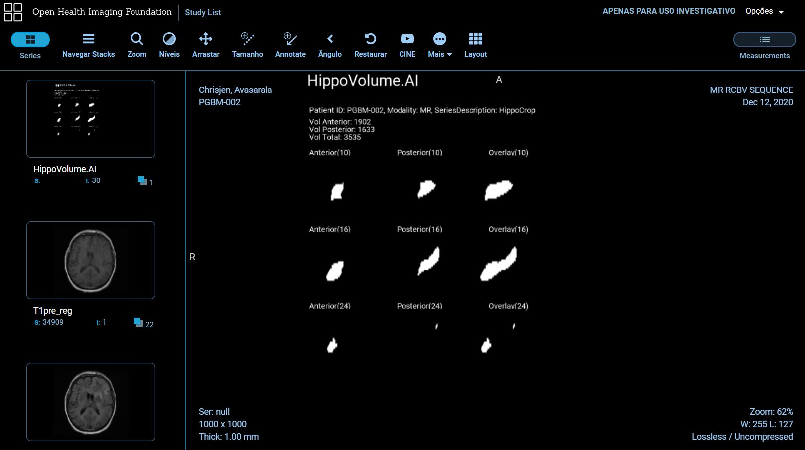

### HIPPOCAMPAL VOLUME QUANTIFICATION IN ALZHEIMER'S PROGRESSION ###

The target of this project is to do an EDA over a dataset of brain MRIs, train a segmentation on a CNN, and integrate this into a clinical network to quantify hippocampal volume for Alzheimerá progression.

## Section #1:

We curate a dataset of brain MRIs.

## Section #2:

We train a segmentation CNN.

The trained model got the metrics:

- mean dice: 0.909
- jaccard: 0.834

## Section #3:

Use the trained model to help clinicians to measure the volume of the hippocampus using MRI scans.

The measurement of hippocampal volume has proven useful to diagnose and track progression of AD, where a reduced volume of the hippocampus, means patients with AD.

